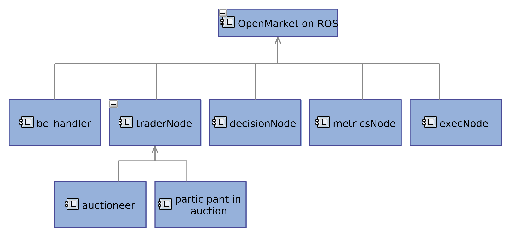
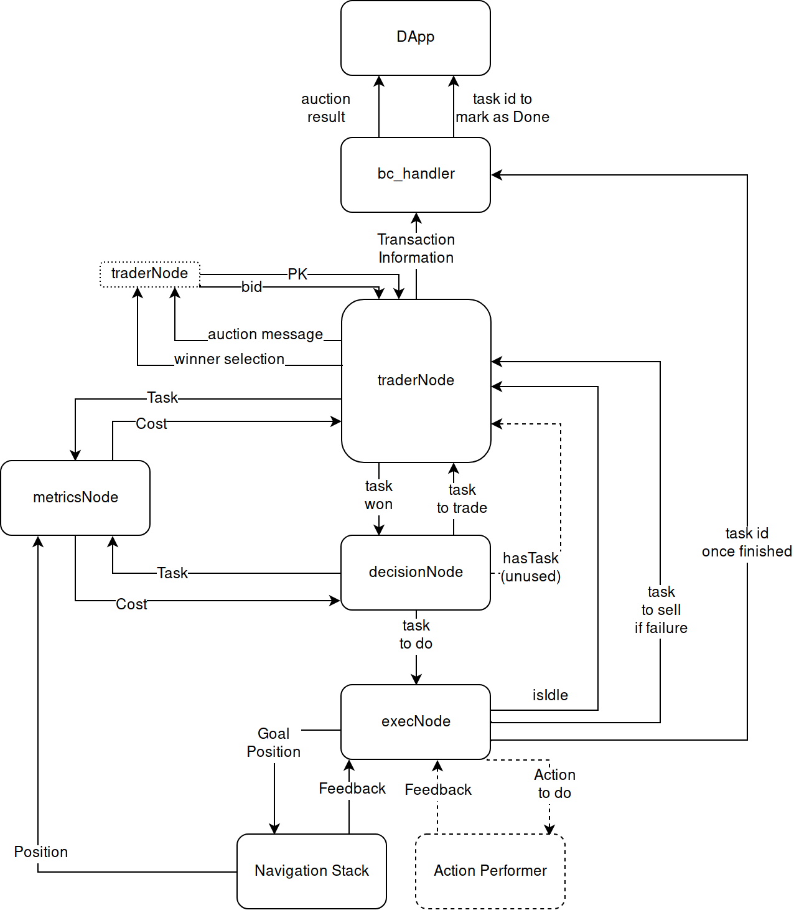
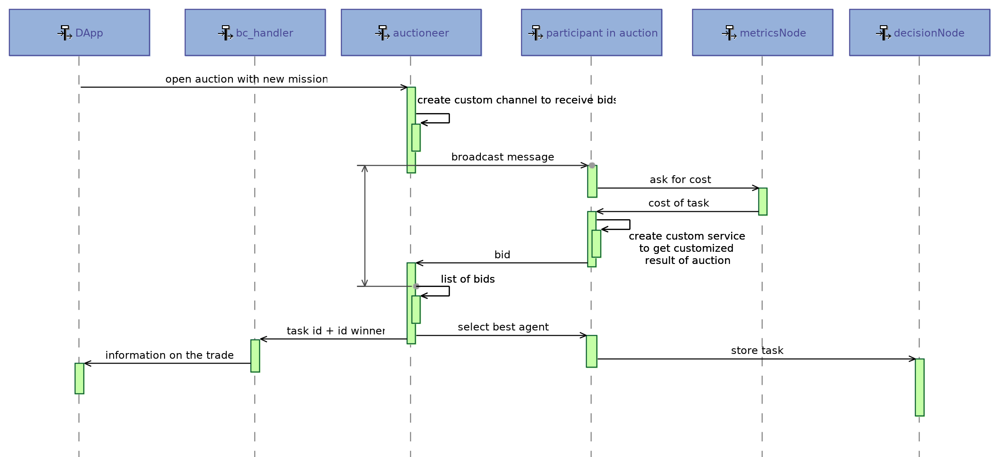

# Open Market Economy for Robots on ROS

## Installation

Install ROS (full) Kinetic (ubuntu 16.04). Instructions [here](http://wiki.ros.org/kinetic/Installation/Ubuntu).

Update gazebo to v7.13. Instructions [here](gazebosim.org/tutorials?tut=install_ubuntu).

Install turtlebot packages. There are used in the simulation.
```sh
sudo apt-get install ros-kinetic-turtlebot*
```

## Compilation
```sh
catkin_make
```

## How to use
### 3 robots

Start the simulation
```bash
roslaunch multirobot gazebo_multirobot.launch
```

Start the open-market nodes
```bash
roslaunch multirobot myNodes.launch
```

### 5 robots
Start the simulation
```bash
roslaunch multirobot gazebo_multirobot5.launch
```

Start the open-market nodes
```bash
roslaunch multirobot myNodes5.launch
```

## Software Architecture
### Logical Components


### Explanations
**bc_handler**
The only purpose of this node is to be an uplink interface between
the robot and a ÐApp. Its only two functions are
- sending the result of auctions in a message including the PK of the seller, of
the buyer and the task id.
- signaling to the ÐApp that a task has been done by sending its id and the
PK of the robot.

This choice has been motivated by the will of keeping one job per node. Hence,
traderNode is only in charge of dealing with auctions. Another important aspect
is, if the ÐApp is unresponsive at some point, bc_handler will try to contact it a
few seconds later.

**traderNode & decisionNode**
Splitting up traderNode into two subcomponents is quite obvious because this node 
participates in auctions another instance
triggered. However, decisionNode needs further explanations: this node is in
charge of storing tasks that have been won by the trader in memory (a vector
object is used) and selecting one task among those available. Then, it checks, with
the metricsNode if the task is not too expensive to achieve. Indeed, the situation
of the robot could have changed between the moment the task has been won and
the moment the task has been selected to be performed. If the benefit is too low,
the task is sent back to the trader to be sold; otherwise, it is sent to the execNode.

**Note:**
for simplification purposes, at the moment, we authorize only one auction
at a time and if the robot is idle, meaning the robot is not busy with a mission.
Consequently, decisionNode has, at most, one task stored in memory.

**execNode**
This node is in charge of decomposing a task into two elements: a
goal position to go to and a task to achieve. It first sends the goal position to
the Navigation Stack and listens to its feedback. Once the position has been
reached, the action associated with the task is performed. Then, the node signals
the bc_handler that the task has been done successfully.
If a problem happens such as, the robot is unable to achieve its goal or if a remote
deactivation has been triggered (more on this in Section 3.2.3), the task is directly
sent to the traderNode. That way, another robot of the team could do it and the
task would not be lost.
Lastly, this node broadcasts the status of the robot (idle or not) so that other
nodes can wait for the robot to be free if necessary.

### Detailed Architecture


## Auction Proceedings - Sequence Diagram


